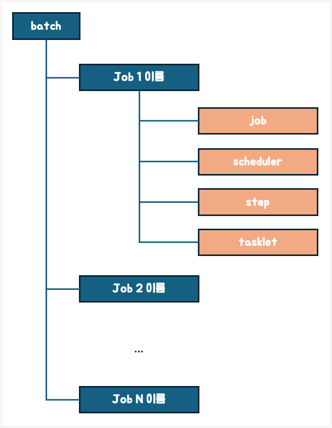

# Spring Batch를 이용한 배치 어플리케이션 구축

---

## 프로젝트 주요 기능과 목적

- Spring Batch 를 학습하기 위함입니다.
- 최종적으로 ***Spring Batch Template*** 을 만드는 것이 목표입니다.

---

## 프로젝트 구조

### 폴더 구조

- `batch` 디렉토리 하위에 각 JOB 이름으로 디렉토리 생성
- 각 JOB 디렉토리 하위에 `job`, `scheduler`, `step`, `tasklet` 디렉토리를 생성
- 각 디렉토리명에 맞게 소스 작업 진행

---

## 설치 방법

1. JDK 21 설치
2. Git pull
3. 어플리케이션 실행

---

## 테스트 방법

H2 웹 콘솔 URL : http://localhost:8180/h2-console 

1. SpringBatchApplication 을 실행합니다.
2. H2 웹 콘솔에 접속하여 실제 JOB 실행 결과를 확인한다.

---

## 의존성 정보

- spring-boot-batch (latest)
- spring-boot-starter-data-jpa (latest)
- spring-boot-starter (latest)
- spring-boot-starter-web (latest)
- lombok (latest) 
- spring-boot-starter-test (latest)
- h2 (latest)
